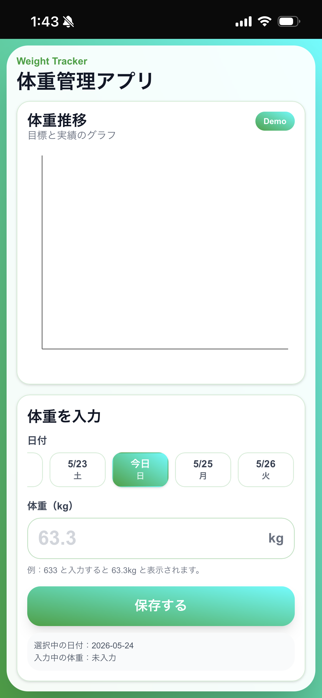

# Weight Tracker App

毎日の体重記録を、最小工数で継続できるよう設計したPWA体重管理アプリです。

## 概要

- スマホ向け最適化UI
- PWA対応
- Google Spreadsheet連携
- 日次の体重推移グラフ表示
- 小数点入力不要な体重入力UX

## UI

<table>
  <tr>
    <td align="center">
      <b>PC版</b><br /><br />
      
    </td>

    <td width="40"></td>

    <td align="center">
      <b>スマホ版</b><br /><br />
      
    </td>
  </tr>
</table>

---

# 使用技術

| 技術 | 用途 |
|---|---|
| Next.js | フロントエンド |
| TypeScript | 型安全 |
| Tailwind CSS | UIデザイン |
| Recharts | グラフ表示 |
| Google Apps Script | API |
| Google Spreadsheet | データ保存 |
| Vercel | ホスティング |

---

# 工夫したポイント

## 1. スマホ・PCでレイアウトを最適化

- スマホでは1画面完結UI
- PCでは横長ダッシュボードUI
- iPhone表示を基準に余白・サイズを最適化

---

## 2. 体重入力工数を削減

小数点入力を不要化。

例：

```text
633 → 63.3kg
```

数字3桁だけで入力可能。

毎日入力する前提のため、
「1タップでも減らす」ことを重視。

---

## 3. 日付スライダーUX

- カレンダーUIではなく横スライダー採用
- 「今日」を中央に自動配置
- 当日を視覚的に強調

日次入力で最も触る範囲だけに集中できるよう設計。

---

## 4. Google Spreadsheet連携

Google Apps ScriptをAPI化し、

```text
Next.js
↓
GAS
↓
Spreadsheet
```

構成でデータ保存。

非エンジニアでもデータ確認・編集しやすい構成を意識。

---

# 今後追加予定

- 体脂肪率管理
- 前日比表示
- 通知機能
- 週間平均
- 月次分析
- ダークモード
- Face IDロック

---

# 起動方法

```bash
npm install
npm run dev
```

---

# デプロイ

Vercelへデプロイ済み。

---

# 作者

個人開発 / AIペアプログラミングで制作
